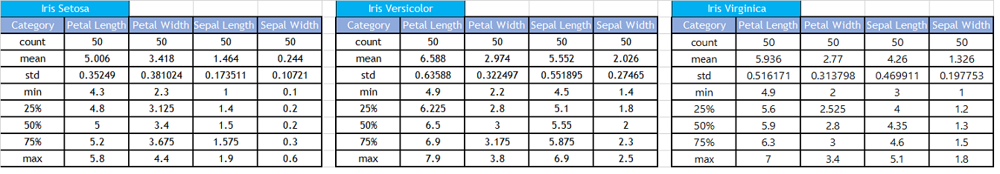
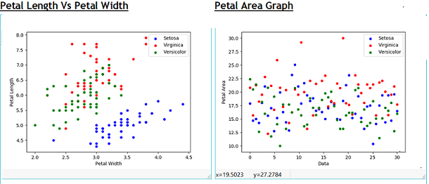
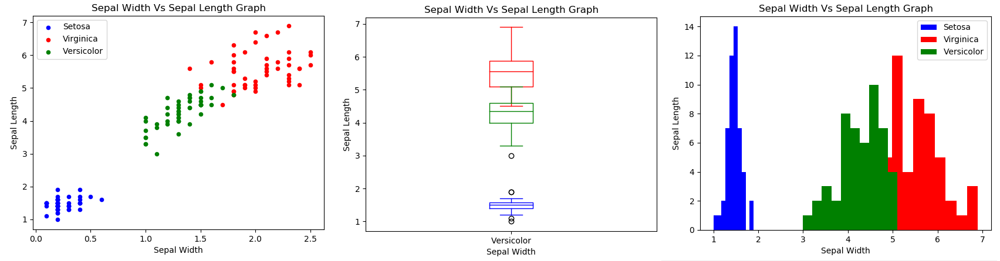

## Project 2018  - Programming and Scripting  - Fisher’s Iris dataset
##### How to run the code in this repository
- Download Anaconda
- Install Anaconda
- Create a "data" folder in your work directory. Copy iris data file in the "data" folder and name the file as "iris"
- Execute Iris-flowerpy in the Terminal using command "python Iris-flower.py"
- Refer "Iris Data - Project Documentation.docx" for documentation on this project 
##### Problem statement
This project requires researching the Fisher’s Iris data set, and then writing documentation and code in the Python programming language based on that research. The below tasks to be performed as part of the project.
- Background information and summary of the Iris Data set 
- Download the data set and write Python code to investigate it. 
- Summarise the data set and document the investigations. 
- Document the supporting tables and graphics.
- Document the references used
 ##### R.A Fisher and Irish Data Set
Sir Ronald Aylmer Fisher (R.A Fisher) was a British statistician and geneticist. His work in statistics created the foundations for modern statistical science and considered as most important person in 20th century statistics.
The key contributions of R.A Fisher are listed below
- One of the key founders of population genetics
- Fisher’s principle
- Fisherian Runaway or runaway selection
- Sexy son hypothesis
- Analysis of Variance (AVOVA)
##### Irish Data Set
The Iris flower is a multivariate data set introduced by the R.A Fisher in his 1936 paper and it is sometimes called Anderson's Iris data set because Edgar Anderson collected the data to quantify the morphologic variation of Iris flowers of three related species.
Two of the three species were collected in the Gaspé Peninsula and picked on the same day and measured at the same time by the same person with the same apparatus. The dataset contains 
- 150 records in total for 3 species of iris flower
- 50 samples from each of Iris flower namely Iris setosa, Iris virginica and Iris versicolor. 
   - Four features were measured from each sample namely Petal length, Petal width, Sepal length and Sepal width
- The length and the width of the sepals and petals, in centimetres. 
Based on the combination of these four features, R.A Fisher developed a linear discriminant model to distinguish the species from each other.
##### Data Set - Analysis and Investigation
Please find the summary of data analysis for each flower based on the given features/attributes

- Count – Number of records in the Iris data file
- Mean – Average of the data set
- Standard deviation (std) – How much the data differs from the mean of the data set
- Minimum (Min) – Minimum value of the data in the data set
- Maximum(Max) – Maximum value of the date in the data set

##### Petal Graph’s - Observations:
- Based on the given data,
   - Setosa attributes/features are distinct from other species of Iris flower (Viriginca and Versicolor)
   - Setosa: 
     - Minimum length and Width: 4.3 cm and 2.3 cm
     - Maximum length and Width: 5.8 cm and 4.4 cm
     - No other flowers have petal length falls below 4.5
     - No other flowers have petal width falls above 4
s     - Straight line/plane can be drawn to demarcate the setosa flower
   - Virginica:
     - Minimum length and Width: 4.9 cm and 2 cm
     - Maximum length and Width: 7 cm and 3.4 cm
     - No other flowers have petal length lower than 2.2
   - Versicolor:
     - Minimum length and Width: 4.9 cm and 2.2 cm
     - Maximum length and Width: 7.9 cm and 3.8 cm
     - No other flowers have petal length greater than 7 cm
   - Overlap between Virginica and Versicolor flower attributes/features

##### Sepal Graph’s - Observations:
- Based on the given data,
   - Setosa attributes/features are distinct from other species of Iris flower (Viriginca and Versicolor)
   - Setosa: 
     - Minimum length and Width: 1 cm and 0.1 cm
     - Maximum length and Width: 1.9 cm and 0.6 cm
     - No other flowers have Sepal length between 1 cm and 1.9 cm
     - No other flowers have Sepal width between 0.1 cm and 0.6 cm
     - Straight line/plane can be drawn to demarcate the setosa flower
   - Virginica:
     - Minimum length and Width: 4.5 cm and 1.4 cm
     - Maximum length and Width:6.9 cm and 2.5 cm
     - No other flowers have Sepal length more than 5.1 cm
     - No other flowers have sepal width more than 1.8 cm
   - Versicolor:
     - Minimum length and Width: 3 cm and 1 cm
     - Maximum length and Width: 5.1 cm and 1.8 cm
     - No other flowers have Sepal width between 1 cm and 1.4 cm
     - No other flowers have Sepal length between 3 cm and 4.5 cm
   - Overlap between Virginica and Versicolor flower attributes/features
   
   

##### References
- Subject References:
   - https://en.wikipedia.org/wiki/Iris_flower_data_set
   - https://en.wikipedia.org/wiki/Ronald_Fisher
   - https://en.wikipedia.org/wiki/Statistical_classification
   - https://en.wikipedia.org/wiki/Multivariate_statistics
   - https://en.wikipedia.org/wiki/Edgar_Anderson
- Technical References: 
   - https://www.techopedia.com/definition/32880/iris-flower-data-set
   - https://www.youtube.com/watch?v=azXCzI57Yfc
   - https://www.analyticsvidhya.com/blog/2017/09/common-machine-learning-algorithms/
   - https://pythonprogramming.net/support-vector-machine-intro-machine-learning-tutorial/
   - http://scikit-learn.org/stable/auto_examples/datasets/plot_iris_dataset.html
   - https://stackoverflow.com/
   - http://pandas.pydata.org/pandas-docs/version
   - https://www.tutorialspoint.com/python_pandas/python_pandas_series.htm
   - https://matplotlib.org/api/pyplot_api.html
   - https://www.datascience.com/learn-data-science/tutorials/creating-data-visualizations-matplotlib-data-science-python

